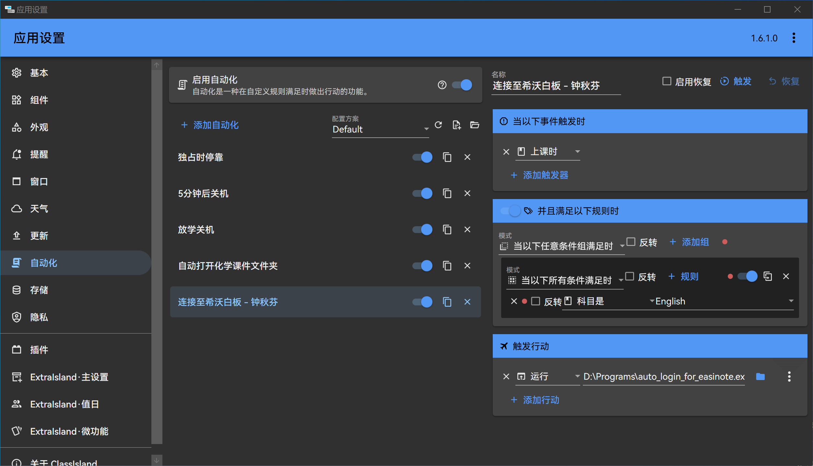

## 概述

还在每节课前手动登录希沃白板吗？[ClassIsland](https://github.com/ClassIsland/ClassIsland/)**「自动化」**与 **Auto Login for EasiNote** 强强联手、珠联璧合，让你的希沃白板使用体验**再飞跃**。

有了 **Auto Login for EasiNote**，登录希沃白板再也不是麻烦事。仅需一行命令，登录流程瞬息可就，让你抛弃重复的输入密码和来回点击，全神贯注投入课堂学习。

:::tip
进一步了解 **Auto Login for EasiNote**：[还在课前输密码？自动登录希沃，告别繁琐操作！](/posts/auto-login-for-easinote/)
:::

## 使用



在 ClassIsland「自动化」中，创建自动化：

* **触发**：上课时

* **条件**：科目是「指定科目」

* **行动**：运行程序，目录指向 Auto Login for EasiNote 的程序位置

此外，你还需要编辑**程序运行参数**来配置自动登录，方法如下：

在 行动-运行程序（也就是上面配置程序路径的地方）的右侧，点击三个点，会展开一个参数输入框，

按照 Auto Login for EasiNote 的 [使用说明](/posts/auto-login-for-easinote/) 编辑好启动参数。

> 基本参数：
>
> * 通过 `-a` 或 `--account` 参数指定账号
> * 通过 `-p` 或 `--password` 参数指定密码
>
> ```shell
> -a ACCOUNT -p PASSWORD
> ```
>
> 其他参数：
>
> * 通过 `-w` 或 `--show-warning` 参数显示警告
> * 通过 `--4k` 参数启用 4K 分辨率适配
> * 通过 `--debug` 参数显示日志输出

完成后如下图：


至此，自动登录便已配置完成。享受解放双手带来的的快感吧！
