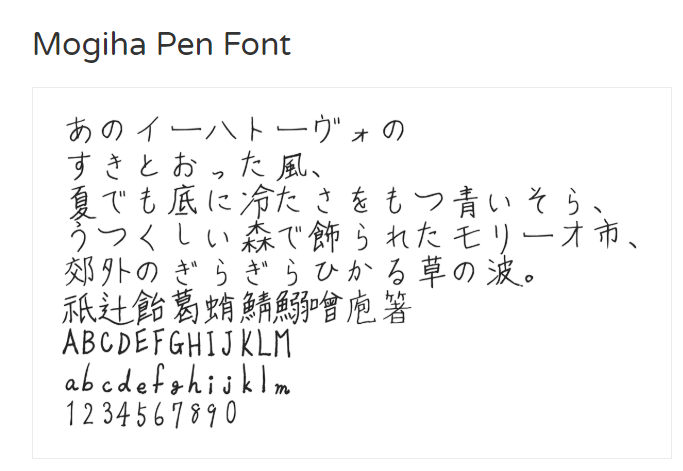
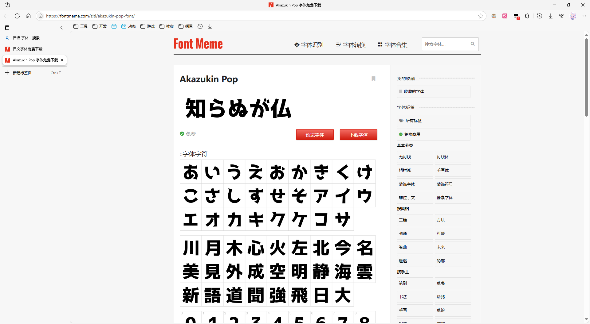
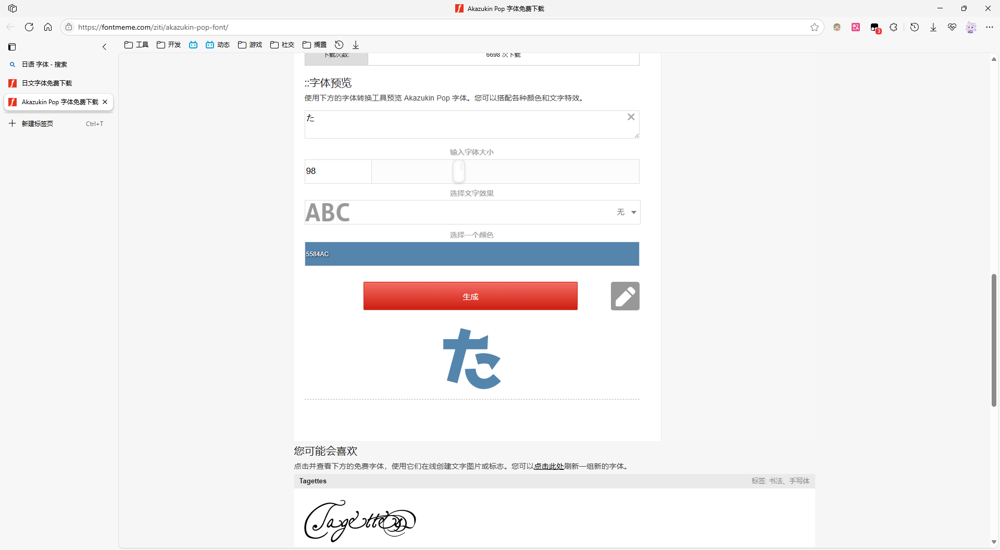

## 视频版本

<iframe width="100%" height="468" src="//player.bilibili.com/player.html?bvid=BV18R8wzEEgR&p=1" scrolling="no" border="0" frameborder="no" framespacing="0" allowfullscreen="true"> </iframe>

## 概述

::github{repo="hxabcd/enji_but_pyqt"}

使用 `Python 3.13` + `PySide6`，仿照[胭脂](https://www.bilibili.com/video/BV1ucGzzuEhw/)的PV制作的 Windows 窗口动画程序。灵感来自于 [BSOD-MEMZ](https://github.com/BSOD-MEMZ) 和 [《强 风 大 窗 口》](https://github.com/SunnyDesignor/PowerfulWindSlickedBackHairCS-LX_Improve)

原PV：[https://www.bilibili.com/video/BV1ucGzzuEhw](https://www.bilibili.com/video/BV1ucGzzuEhw)

原作者：[蛋包饭咖喱饭](https://www.bilibili.com/video/BV1ucGzzuEhw/)

:::note
程序启动时需要释放和载入资源文件，可能要耗费较长时间；程序峰值内存占用可能达到 860MB
:::

:::note
程序在运行过程中会动态加载资源，如您的运行设备性能一般，动画的播放可能会发生滞后
:::

支持的系统：Windows 10 及以上版本 | [下载](https://github.com/hxabcd/enji_but_pyqt/releases)

## 亮点

### 与原PV相同的字体

别问，我也好奇怎么找出来的。

【打开 Google】【点击搜索框】【输入 "Japanese font"】【一番激情的查找】

欸等等，这个怎么有点像？



【下载字体】【打开 Word】【打开原视频】【一番激烈的比对】

我去 还真是……

另外一个た的字体过程可能也差不多，就不赘述了，可能是运气好吧（





*显示た的样例*


*原视频中的字体*

### 基于时间的帧控制

```python title="main.py" {1, 2, 6, 13}
def sequence_update(pos):
    if 0 <= pos < 700:
        app.yan.preload_seqframe(get_res("frames/yan"))
        app.zhi.preload_seqframe(get_res("frames/zhi"))
        app.small_teto1.preload_seqframe(get_res("frames/small_teto1"))
    elif 700 <= pos < 9160:
        app.yan.show()
        app.zhi.show()
        app.small_teto1.show()
        app.yan.widget.start_loop(3)
        app.zhi.widget.start_loop(3)
        app.small_teto1.widget.start_loop(3)
    elif 9160 <= pos < 11791:
        app.yan.hide()
        ...
```

如上述代码，动画的播放是根据播放进度控制的

一开始有想过用sleep什么的，发现根本不准，容易牵一发而动全身，很快否决了。后来 ChatGPT 先生再次提出了他的高见：用 QMediaPlayer，还能检测播放进度


好用爱用😋

### 动态资源加载

这得追溯到开发到到一半的时候……


仅仅37帧，更何况这样的还有六个

全部加载恐怕得上到2G……

于是不得不将动态加载提上日程，踩了不少坑，但结果相对来说还是比较显著的（虽然最后还是有 860MB...）

### 关键帧动画

跟上面的动态加载差不多，都是为了减少内存占用。一开始想直接用序列帧，结果嘛自然是内存爆炸。反手让AI写了个关键帧提取器（还放在目录的 /tools 目录下面，感兴趣的可以看看），出乎意料的好用

### 尽可能少的 AI 使用

幻觉：你好

实际上不使用AI的真实原因是我免费额度用完了，加之懒得折腾那些东西

正好可以锻炼一下自己的水平（

------

这些真的有用……吗？

其实只要足够生草就行了，大抵是这个人喜欢造轮子罢……
